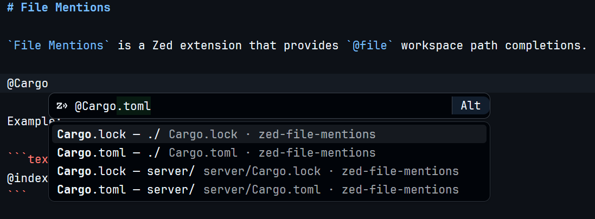

# File Mentions

`File Mentions` is a Zed extension that provides `@file` workspace path completions.

- `@file-query` completion for workspace file path.
- `.gitignore` / `.ignore` aware scanning.
- Default exclusion for `.git`, `node_modules`, `.venv`, `venv`, `dist`, `build`, `target`, `.next`, `coverage`, Python caches, and similar noisy directories.
- File watcher based index refresh with a TTL rescan fallback.


Example:

```text
@index.ts
```

Completion inserts:

```text
@src/index.ts
```



## Development

> [!NOTE]
> This feature is implemented via LSP extensions, since zed, unlike vscode, does not provide flexible extension mechanisms.  
> However, it is not a dedicated LSP extension — it provides no diagnostics, hovers, etc. — it merely leverages the completion feature.

```text
.
├── extension.toml
├── Cargo.toml              # Zed extension WASM wrapper crate
├── src/lib.rs
├── server/                 # Native LSP server; separate Rust project
└── docs/development/
```

The native LSP server intentionally lives outside the root Cargo workspace. Zed compiles the root extension crate as WASM; the LSP server is a native process launched by the wrapper.

### Development status

This repository is currently a development prototype.

The native language server binary is not yet downloaded automatically by the Zed extension wrapper. For local development, either:

1. configure `lsp.file-mentions-lsp.binary.path`, or
2. put `file-mentions-lsp` on `PATH`.

This is a development/testing override, not the intended final end-user installation path.

A published extension should resolve the native LSP binary internally, typically by downloading a platform-specific release asset or by finding a system-installed binary. Users should not normally need to add `binary.path` just to use the extension.

### Local development install

Build the native language server:

```bash
cargo build --manifest-path server/Cargo.toml --release
```

Configure Zed to find the binary:

```json
{
  "lsp": {
    "file-mentions-lsp": {
      "binary": {
        "path": "/absolute/path/to/zed-file-mentions/server/target/release/file-mentions-lsp"
      }
    }
  }
}
```

On Windows, point to `file-mentions-lsp.exe`.

Then install the extension as a Zed dev extension from this repository root.

Important: Zed `settings.json` is not a registry of installed language servers. Installed LSP extensions do not necessarily appear under the `lsp` key. The `lsp` section is mainly for user overrides such as binary path, initialization options, or server-specific settings.

### Dev Commands

```bash
cargo build --manifest-path server/Cargo.toml --release
cargo test --manifest-path server/Cargo.toml
```

Root crate build is the Zed extension wrapper only:

```bash
cargo check
```

## Configuration

User-facing behavior may be configured through `lsp.file-mentions-lsp.initialization_options`:

```json
{
  "lsp": {
    "file-mentions-lsp": {
      "initialization_options": {
        "index": {
          "watch_files": true,
          "respect_gitignore": true,
          "respect_ignore_files": true,
          "include_hidden": false,
          "follow_symlinks": false,
          "max_files": 100000,
          "max_results": 50,
          "refresh_ttl_seconds": 60,
          "debounce_ms": 700,
          "include": ["**/*"],
          "exclude": ["**/vendor/**"]
        },
        "insert": {
          "keep_trigger": true,
          "quote_paths_with_spaces": false
        },
        "completion": {
          "trigger": "@",
          "min_query_len": 1
        }
      }
    }
  }
}
```

User `exclude` patterns are additive. Built-in hygiene excludes remain active.


## TODO | Published extension

Before marketplace release, add binary resolution logic to the wrapper:

```text
current platform
  -> choose matching release asset
  -> download native file-mentions-lsp binary
  -> make executable where needed
  -> launch downloaded binary
```
